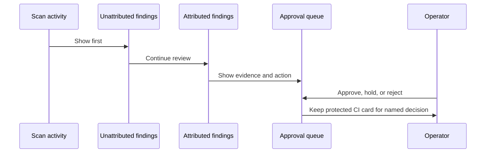
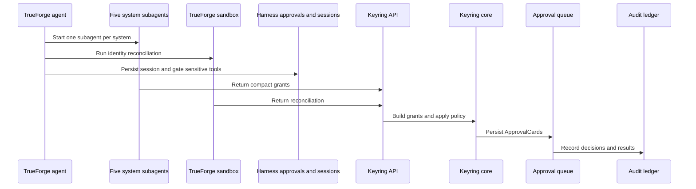

# Keyring

Every company can list its employees. None of them can list what those employees can still access.

## The problem

When someone leaves a company, their access is spread across many systems. A manager may remove a GitHub collaborator but miss a personal Google Drive share, an old Slack role, or an automation key. Checklists fail because they depend on one person remembering every system and every kind of access. The result is wasted review time, unnecessary risk, broken automation, and no reliable record of what was checked.

## What Keyring does

Keyring collects access grants from connected systems into one review queue. It links usernames, work emails, personal emails, keys, and directory records without guessing when the evidence is weak. It treats AI agents as first class principals, recording their runtime, purpose, reachable tools, owner, and declaration status. It proposes an action for each grant and keeps protected resources in a separate human approval path. After approval, it can run the action and records the decision, result, and verification data in an append only ledger.

Read [`docs/AGENT-IDENTITY.md`](docs/AGENT-IDENTITY.md) for the agent identity
model, evidence sources, risk treatment, and OWASP and NIST mapping.

## Approval queue

The queue keeps the important facts visible before anyone decides.



## Quickstart

Requirements are Node 20 or newer and pnpm 9 or newer. The demo needs no API keys, Docker, Postgres, or cloud account.

```bash
pnpm install && pnpm demo
```

Open http://127.0.0.1:5173 and select **Run guided demo**, or start a scan for **Ada Lovelace**. The demo uses the checked in recording at `fixtures/recordings/ada-lovelace.json`, embedded PGlite, replay events, and dry run execution. The guided demo pauses at the protected CI card until you select **Continue**. Use **Stop** to discard an aborted demo take and start again.

## Architecture



TrueForge owns the agent loop, model calls, subagents, sandbox, MCP routing, harness approvals, and session persistence. Keyring owns grant semantics, identity reconciliation rules, policy, connectors, the HTTP API, the approval queue, execution policy, and the audit ledger.

## How Keyring uses TrueForge

The agent asks TrueForge for the connected systems and starts one subagent per system. Each subagent inventories access through a read only MCP server and returns a compact grant list. Keyring combines those grants and runs identity reconciliation in the TrueForge sandbox when one is available. The result becomes ApprovalCards in the Keyring queue. Any irreversible or protected action requires a harness approval before the mutate tool can run. TrueForge sessions retain turns and events, so a reconnect can resume the same work instead of starting a second turn.

## Safety guarantees

- Dry run is the default. `KEYRING_EXECUTE_DRY_RUN=1` walks the execution path without calling mutating provider APIs.
- The scan path is read only. Inventory uses read credentials and the scan MCP server. Mutations use the separate mutate MCP server after approval.
- The audit ledger is append only. A database trigger rejects updates and deletes, and the hash chain can be verified with `pnpm verify:audit`.
- Protected resources cannot be bulk approved. Policy can identify service accounts, protected resources, staleness rules, and optional auto approval.
- A hard spend cap stops model work cleanly. The default is `$0.50`, controlled by `KEYRING_HARD_CAP_USD`.
- Credentials stay in environment variables or the harness configuration. They are not stored in the agent manifest, recordings, or committed fixtures.

## Development and testing

Install dependencies, then run:

```bash
pnpm lint
pnpm typecheck
pnpm test
```

The suite uses local fixtures and embedded test databases. It does not require provider credentials. Use `pnpm audit:secrets` before sharing a branch. See [`CONTRIBUTING.md`](CONTRIBUTING.md) for the pull request workflow.

More detail is available in [`docs/HARNESS.md`](docs/HARNESS.md), [`docs/API.md`](docs/API.md), [`docs/CONNECTORS.md`](docs/CONNECTORS.md), [`docs/IDENTITY.md`](docs/IDENTITY.md), [`docs/AGENT-IDENTITY.md`](docs/AGENT-IDENTITY.md), [`docs/POLICY.md`](docs/POLICY.md), [`docs/EXECUTE.md`](docs/EXECUTE.md), [`docs/COSTS.md`](docs/COSTS.md), [`docs/UI.md`](docs/UI.md), [`docs/AGENT.md`](docs/AGENT.md), and [`docs/TEST_ORG.md`](docs/TEST_ORG.md).

## Limitations

The default demo is replay based. It verifies the UI, API, decision path, dry run execution, streamed results, and ledger hash verification without making provider calls. The TrueForge driver has been exercised against the local harness and the Keyring MCP endpoints, including the five system fan out, reconciliation, and card persistence. Live GitHub and Google Workspace provider operations remain opt in and require credentials, a configured MCP server, and a throwaway test organization. The repository does not claim that every live provider response or live mutation path has been verified.

## Qodo Code Review Evidence

Qodo was installed before the first feature commit and reviewed all nine pull requests. Nothing merged to `main` without a review.

**Representative merged PR:** [#2, audit chain fork regression](https://github.com/GautamTalksDev/keyring/pull/2)

Qodo found that a regression test permanently altered the `recorded_at` column default and never restored it, leaking a fixed timestamp into every subsequent test on the shared Postgres backend. We wrapped the mutation in `try/finally` so restoration happens even when an assertion fails. The PR history records the completed review, our decision to fix the isolation leak rather than add a retry, and Qodo's follow up review against the final code before merge.

The deepest fix Qodo prompted was in the audit ledger. A test failed once and passed on retry, but the underlying issue was that two records written in the same millisecond could claim the same parent and fork the hash chain. That meant the tamper-evident ledger was not tamper-evident under concurrent writes. We fixed it with a monotonic sequence column, a unique constraint on the parent hash, and an advisory lock.

Other merged PRs with substantive Qodo findings, all fixed before merge:

- [#8, demo and security hardening](https://github.com/GautamTalksDev/keyring/pull/8) fixed five bugs, including a demo card limit applied to production scan paths that silently dropped grants from real audits, and a secret scanner that reported success without scanning anything.
- [#7, guided demo safeguards](https://github.com/GautamTalksDev/keyring/pull/7) fixed four bugs, including guided demo decisions committing server-side after a stop.
- [#9, queue legibility](https://github.com/GautamTalksDev/keyring/pull/9) fixed the UI labelling declared agents as unregistered because it inferred registration from missing attribution instead of reading the authoritative declaration status.

## AI assistance disclosure

This project was developed with assistance from Cursor, an AI coding agent. Humans directed the product decisions, safety defaults, tests, review, and final verification. Cursor assisted with implementation, refactoring, testing, and documentation drafting, as permitted by the hackathon rules.
